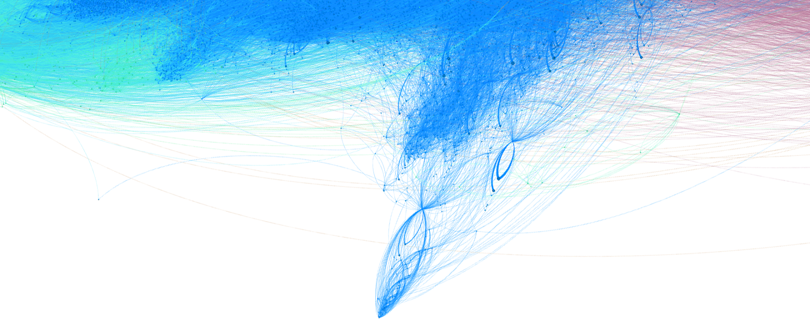

# Twitter community detection

The purpose of this project was to create who-follows-whom graph based on Twitter data and detect communities using most popular community detection algorithms.
The outcome of this project is a graph that has over 100k vertices and over 4 mln edges with communities that were detected using the following algorithms:
 - Modularity
 - Infomap
 - Label propagation
 - Multilevel

This repository contains set of scripts for:
 - crawling Twitter users data (basic info, followers and most popular hashtags)
 - creating who-follows-whom graph based on crawled data
 - detecting communities in the created graph

Detailed report available at [Google Docs](https://docs.google.com/document/d/1oZnyGmy2KZUxLV8CVrPNdXvgDunIy0JbOYjJV3sTsYE/edit?usp=sharing) (Polish version only)

## Visualizations

Visualizations were made using [Gephi](https://gephi.org/).

### Whole graph after community detection with modularity:

### Selected communities

#### "Hobby" community

Most popular hashtags in this community:

#### Multiple small communities

### Most important nodes in the graph

## Data and results

Crawled data and analysis results can be found at [Google drive](https://drive.google.com/drive/folders/1E7c0vY1KXa-LLMnq9GPLmquoPHlcAdj0?usp=sharing).

## Repository structure
- **detect_comunities.py** - script for running community detection algorithms (Infomap, Label propagation, Multilevel)
- **fetch_followers_scrapper.py** - script for downloading followers by scrapping mobile version of Twitter using twint library, taking an initial user, download information about who they follow. Repeat recursively.
- **fetch_hashtags_api.py** - script for downloading hashtags for users using twitter API
- **gen_graph_csv_edge_list.py** - script for generating graph in form of edge list, saving it to .csv file
- **get_graph_gml.py** - script for generating graph in form of nodes list + edges list, saving it to .gml file
- **draw_community_histogram.py** - script for drawing histograms of communities sizes for different community detection algorithms
- **draw_wordmap.py** - script for drawing wordmaps of hashtags for small-size, middle-size and large-size communities for different community detection algorithms
- **clean_duplicated_user_files.py** - script for cleaning duplicated user files (race-condition between threads)

## Authors
 - Karol Bartyzel,
 - Mieszko Makuch
